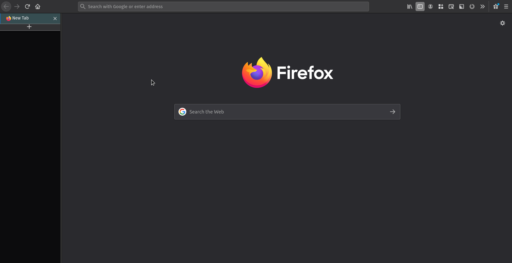

# jupyter-rust Summary
A prototype docker container for jupyter lab with rust. Inspired by: [evcxr_jupyter](https://github.com/google/evcxr/blob/master/evcxr_jupyter/README.md) and [Data Analytics with Rust Notebooks](https://datacrayon.com/)

Work produced in the jupyter lab is saved in the `notebooks` directory. It persists after docker container is stopped.

This can be built on your local machine or you can [follow the instructions here](https://hub.docker.com/repository/docker/zie0/jupyter-rust) to download the image and launch the container in a couple of commands.

# To Build

1. clone the repo

2. `docker-compose up`

3. open link > new > Rust

to change kernel
kernel > Change Kernel > (Rust|python3)



# Image Details

Image components' versions:
* base docker image -> rust:1.49
* conda version -> 4.9.2 
* jupyter version -> 4.7.0
* evcxr_jupyter = "0.8.0"

## Jupyter Version Details
```
# jupyter --version
jupyter core     : 4.7.0
jupyter-notebook : 6.2.0
qtconsole        : not installed
ipython          : 7.12.0
ipykernel        : 5.4.2
jupyter client   : 6.1.11
jupyter lab      : not installed
nbconvert        : 6.0.7
ipywidgets       : not installed
nbformat         : 5.1.2
traitlets        : 5.0.5
```
